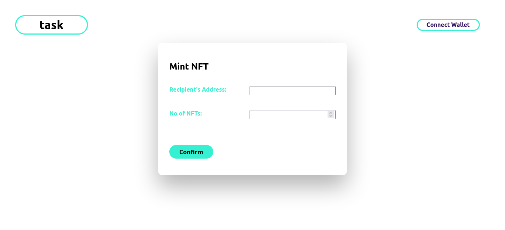

# PKT NFT

This is a simple NFT minter application that give users the opportunity to mint their own NFTs. Multiple NFTs can be minted at once by users. The application uses IPFS as storage for NFT metadata and the IPFS url is dynamically generated.

The frontend uses minimal design and users can connect to their metamask wallet to sign off transactions (gas fee) in order to mint. The design is responsive with different break points adapted for mobile, tablet and desktop versions.


- Home



## Live Demo
TBD

## Built With
- Soilidity
- Typescript
- Hardhat
- React
- HTML5
- CSS3
- jest
- Chai
- Web3

## Getting Started

To run a local version of this application, follow the steps below:

- Go to the "Code" section of this repository and press the green button that says "Code". Copy the URL or the SSH key.
- Go to the terminal and enter:
```
git clone URL/SSH key
```

The URL or SSH are the links copied from the first step above.

- If you don't have git installed, you can download this project and unzip it.
- Change directory into the folder the application is saved.
```
cd directory
```
Directory is the name of your folder.

- Once you have the local copy in your desired folder, go back to your terminal and run:
```
npm install
```
This command installs all the dependencies of the application.

## Smart contract and Hardhat
TBA


- To start using the application, run:
```
npm start
```
- The application will open up in your browser.

## Usage

- Connect to metamask using the "connect wallet" button.
- Once an address is connected, you can fill in the appropriate form fields, including the number of NFTs to be minted.
- Metamask would prompt you to sign the transaction off and to pay the application gas fees.
- Your NFTs would be minted and same could be confirmed on the recipient account or on any Ethereum block explorer.

## Tests

### React components unit testing

- To run the tests, in the command line interface, type 
```
npm test
```

### Smart contract unit testing

TBA

## Developer

👤 **George Gbenle**

- GitHub: [george-shammar](https://github.com/george-shammar)
- Twitter: [@GeorgeShammar](https://twitter.com/GeorgeShammar)
- LinkedIn: [George Gbenle](https://www.linkedin.com/in/georgegbenle/)

## 🤝 Contributing

Contributions, issues and feature requests are welcome!

## 📝 License
TBA

